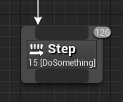
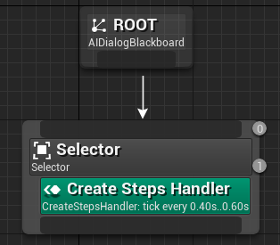
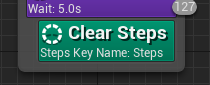
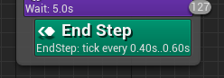
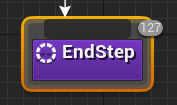
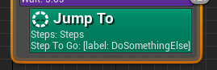
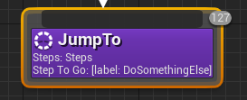
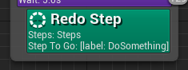
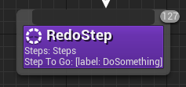

# Behavior steps

This plugins offer a simple way to create a steps flow on a behavior tree.

> :information_source: To see a most advanced usage, please take a look at my Dialog System plugin:  
> https://github.com/NansPellicari/UE4-DialogSystem

|                                                                                                                                                                                                              |
| :---------------------------------------------------------------------------------------------------------------------------------------------------------------------------------------------------------------------------------------------------------------------------------------------------------------------------------------------------------------------------------------------: |
| I've decided to make all the code I developed for my games free to use and open source.  I am a true believer in the mindset that sharing and collaborating makes the world a better place.  The thing is: I'm fulltime dedicated to my project and these open source plugins, for coding I need a looooot of coffee, so please, help me to get my drug :stuck_out_tongue_closed_eyes: !! |

<!-- TOC -->

-   [1. Requirements](#1-requirements)
    -   [1.1. UE4 Plugins](#11-ue4-plugins)
-   [2. Steps Handler](#2-steps-handler)
-   [3. Behavior Tree nodes](#3-behavior-tree-nodes)
-   [4. Contributing and Supporting](#4-contributing-and-supporting)

<!-- /TOC -->

## 1. Requirements

### 1.1. UE4 Plugins

-   [NansUE4TestsHelpers](https://github.com/NansPellicari/UE4-TestsHelpers) (free UE4 plugins)
-   [NansCoreHelpers](https://github.com/NansPellicari/UE4-CoreHelpers) (free UE4 plugins)

## 2. Steps Handler

-   The **StepsHandler** is a c++ Interface (see [IStepsHandler.h](./Source/NansBehaviorStepsCore/Public/IStepsHandler.h)), which allow you to create you own StepsHandler object.
-   It is instanciated by the **CreateStepsHandler** service's node (see section below) in a BehaviorTree (aka BT), you just have to choose the class object you need to work with.
-   A basic **StepsHandler** (see [StepsHandlerBase.h](./Source/NansBehaviorStepsCore/Public/StepsHandlerBase.h)) is provided here, this way you can directly use this plugin.
-   In the [GGTest](./Source/GGTest) folder, you can check directly some basics usages.

## 3. Behavior Tree nodes

| Node                                                                                            | Node Type    | Usefull for/when                                                                                                                                                                                                                                                                                     |
| ----------------------------------------------------------------------------------------------- | ------------ | ---------------------------------------------------------------------------------------------------------------------------------------------------------------------------------------------------------------------------------------------------------------------------------------------------- |
|                                                             | Composite    | It is dedicated to control the **steps flow**. It checks first if it can run children depending on its order in the BT, then it plays all of the children (you can choose to play them as **sequence** or **selector** nodes do). When the last children is played, it allows the next step to play. |
|                              | Service      | It should be the first element you need in your Behavior tree, it instances the **steps Handler** object and save it into the BlackBoard (BB) for the next nodes.                                                                                                                                    |
|                                              | Service      | This should be called before ending the BT. It cleans up the **handler** to its initial state.                                                                                                                                                                                                       |
|      | Service/Task | (Optional) You can used it to prematurely end the current step. It can be associated to a Decorator node for example to create an optional BT branch.                                                                                                                                                |
|           | Service/Task | It tells to the **handler** which is the next step to play, breaking the default flow.  :warning: Be careful that it can't replay and already played step. For that use **RedoStep**.                                                                                                             |
|   | Service/Task | This will replay an already played step.  :warning: Be aware of: this will reset all steps which has been played after the steps you specified in the Steps Handlers history.                                                                                                                     |

## 4. Contributing and Supporting

I've decided to make all the code I developed for my games free to use and open source.  
I am a true believer in the mindset that sharing and collaborating makes the world a better place.  
I'll be very glad if you decided to help me to follow my dream.

| How?                                                                                                                                                                               |                                                                                         With                                                                                         |
| :--------------------------------------------------------------------------------------------------------------------------------------------------------------------------------- | :----------------------------------------------------------------------------------------------------------------------------------------------------------------------------------: |
| **Donating**  Because I'm an independant developer/creator and for now I don't have  any income, I need money to support my daily needs (coffeeeeee).                        |  |
| **Contributing**  You are very welcome if you want to contribute. I explain [here](./CONTRIBUTING.md) in details what  is the most comfortable way to me you can contribute. |                                                                         [CONTRIBUTING.md](./CONTRIBUTING.md)                                                                         |
